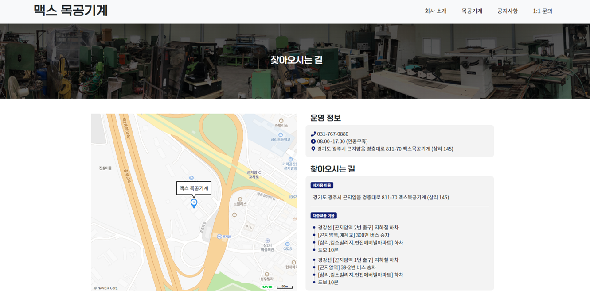
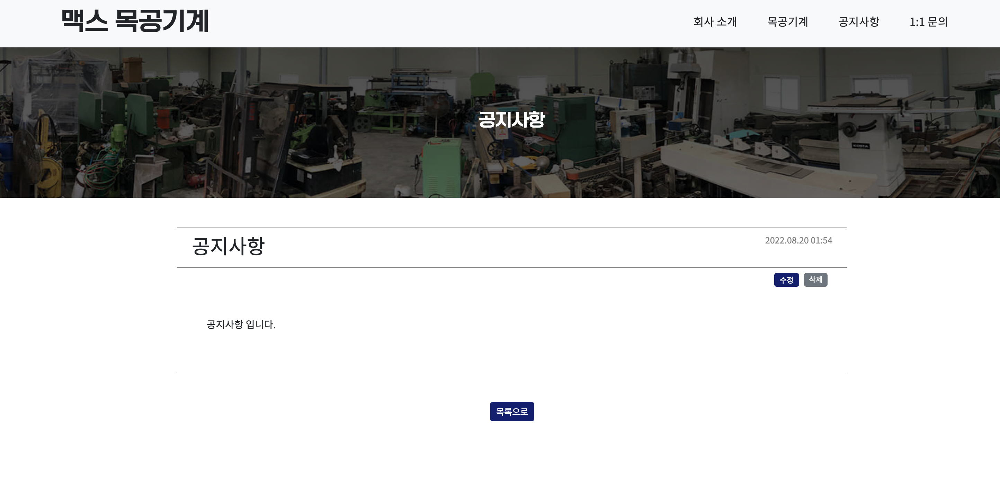
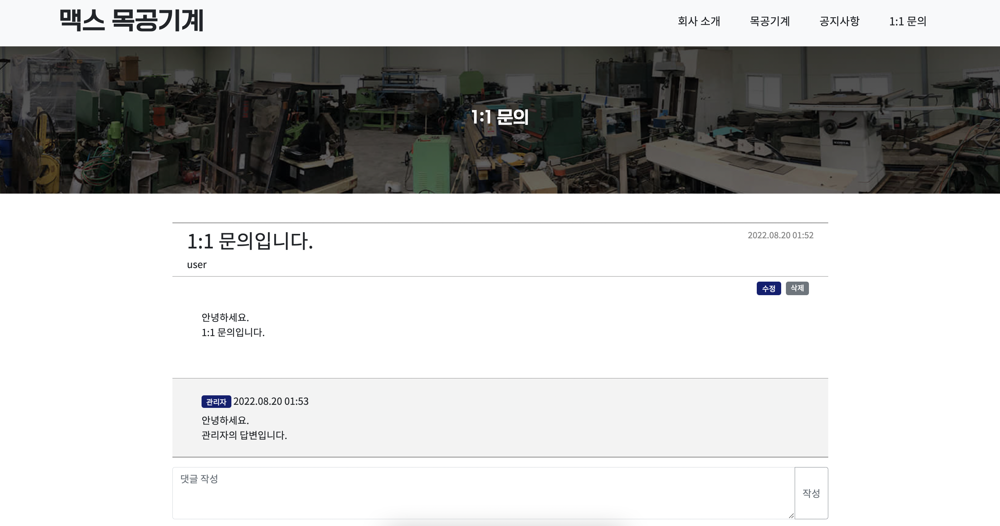

# 🎇 서비스 소개

- 개요 : 맥스 목공기계에서 사용할 웹 사이트 제작
- 기술 스택 : Django, Django Template, Bootstrap
- 팀원 : 이다은, 이산하

<br/>

<br/>

# 🎈 주요 기능

- 공지사항, 일대일 문의 게시글 작성 CRUD 기능
  - 공지사항, 일대일 문의 답변에서 관리자만 글 작성 가능
- 목공기계 게시글 작성 CRUD 기능
  - 관리자만 글 작성 가능
  - 기계 이미지 첨부 및 썸네일 크기 축소
  - 신품/중고 기계 선택 및 필터링
- 네이버 맵 API를 활용한 판매점 위치 표현
- 반응형 웹페이지

<br/>

<br/>

# 🎊 구현

## 홈


<br>

## 회사소개



<br>

## 공지사항



<br>

## 목공기계


<br>

## 일대일 문의




<br/>

<br/>

# 🎗 실행 방법

```
// 가상환경 설정
python3 -m venv venv
source venv/bin/activate
pip install -r requirements.txt

// 장고 실행
python3 manage.py runserver
```